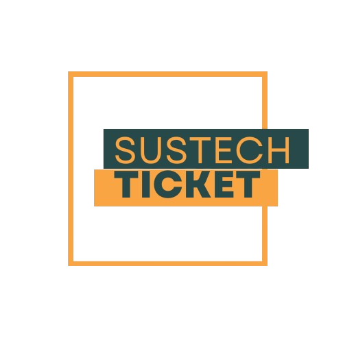

<div align=center>


# SUSTech TICKET

**CS304 Project for Software Engineering**

</div>

# Website Documentation

Welcome to the documentation for SUSTech TICKET Website. This guide will help you understand and use the features of our website effectively.

## Table of Contents

1. [Introduction](#introduction)
2. [Getting Started](#getting-started)
3. [Features](#features)
4. [FAQs](#frequently-asked-questions)
5. [Troubleshooting](#troubleshooting)
6. [Developer Guide](#developer-guide)
7. [API Documentation](#api-documentation)

## Introduction

### Key Features

- **Event Recommendations**: You will get recommendation of various event at SUSTech!
- **Online Event Booking**: Book your ticket online.
- **Event Rating**: Rate and give comment on your purchased ticket.
- **Live Customer Service Support**: 24 hours live customer service to assist your problem.
- **Coins / Gift / Discounts**: Accumulate and redeem your point.
- **Nontification**: Get notified to stay up to date!

For more details on how to use these features, please refer to the [Features](#features) section.

## Getting Started

This guide will help you get started with SUSTech TICKET Website.

### Login

1. Go to the [login page](https://susticket-main.vercel.app).
2. Login with your SID and Password

If you are non SUSTech student, you will not able to login to access specific features. However, you can go through the website to stay up to date about SUSTech's events. For special inquiries, please email at sustech_ticket@mail.edu.cn.

### Basic Navigation

- **Home**: You can get recommendation of events at SUSTech. For better experience, you can filter the events according to available categories and period. You can also find the event by typing your searched keyword in the the search bar or locate position through the map.
- **Event Information**: By clicking the event, you will be able to see event's detail regarding on the ticket price, event time and location, availability, and the contact info.
- **Get TIcket**: By clicking the Get Ticket button, you will be directed to seat selection. Choose your desired seat, then put the ticket to the cart ot pay directly to purchase. For now, the payment method only available through PayPal. Make sure you have enough PayPal balance to purchase.
- **Bookmark Page**: You can find your bookmarked event in the bookmark page through task task bar. 
- **My Ticket** After purchasing the ticket, you will be able to find your purchased ticket in the My Ticket page. You can find it out through the task bar.
- **Calendar** For convenient view, you can find the events in the Calendar page. You can find it out through the task bar.
- **Customer Service** Don't hesistate to contact us through live customer service in the bottom corner if you have any specific question or help.

For more detailed guides, check out the [Features](#features) section.

## Features

### Event Recommendations

**Description**: Get recommendation of various event at SUSTech.

#### How to Use

1. Navigate to Home Page.
2. You can filter according to available category and time period.
3. You may also want to find the event trough the search bar or location on the map.
4. If you want to find events in the calendar, navigate to the calendar page available in the search bar.

### Online Event Booking

**Description**: Book ticket online.

#### How to Use

1. Navigate to the event you are interested to attend.
2. Click "Get Ticket" button.
3. Select the available ticket or seat.
4. If you want to directly purchase the ticket, click "Get Ticket Now" button.
5. If you want to buy ticket later or purchase in a bulk, click "+Add to Cart" button.
6. Redeem coin to get extra dicount if you have enough coins.
7. Pay using PayPal.
8. If payment successful, you will be directed to the Home Page and you will get extra coins.
9. Go to "My Ticket" through the task bar to view your purchased tickets.

### Event Rating

**Description**: Rate and give comment on your purchased ticket.

#### How to Use

1. Go to "My Ticket" through the task bar to view your purchased tickets.
2. Or, you can navigate to your purchased event information. The "Give Comment" button will be automatically appeared, click it this button.
3. Rate 1-5 stars, give brief description, and/or upload photo.
4. Click "Submit" button to submit your comment.

### Live Customer Service Support

**Description**: 24 hours live customer service to assist your problem.

#### How to Use

1. Click the icon in the bottom right corner of the screen.
2. Start conversation with SUSTech Ticket admin.

### Coins / Gift / Discounts

**Description**: Accumulate and redeem your point.

#### How to Use

1. Purchase ticket to get coins.
2. Reedem your coins during checking out to get extra discount.

### Nontification

**Description**: Get notified to stay up to date.

#### How to Use

1. Click the Notification icon in the taskbar.
2. The nontifications are order vertically by the latest update.

## Frequently Asked Questions

### Question 1

**Q**: Can I access the website through my mobile phone?

**A** Yes. You can access the website through any devices as long as you are connected to the internet.

### Question 2

**Q**: How long the admin will reply my messages?

**A**: The admin will reply your message when she/he is availble online. Please be patience.

### Question 3

**Q**: What should I do if loading takes long time?

**A**: In this case, the problem may lye on network issue or the server down. Please kindly wait and ensure you have stable internet connection.

### Question 4

**Q**: How many coins will I get in each transaction?

**A**: You will get 5 coins for each purchased ticket. For one coin redeemed during checkout, you will get 1 yuan discount.

### Question 5

**Q**: Can I use WeChat Pay or Alipay for payment?

**A**: Unfortunately, for now only PayPal is available as payment method. Make sure you have PayPal account and enough balance to purchase the ticket.


### Question 6

**Q**: What password do I use for login?

**A**: U can login using the same password you use to access sustech account. In case you forget your password, please contact sustech admin through email to reset password.

For more questions and answers, visit the [Troubleshooting](#troubleshooting) section.

## Troubleshooting

### Common Issues

#### Issue 1: Unable to Log In

**Solution**:
1. Ensure you are using the correct email and password.
2. Check your internet connection.

#### Issue 2: Page Not Loading

**Solution**:
1. Refresh the page.
2. Clear your browser's cache.
3. Try accessing the page from a different browser.

## Developer Guide

This section provides all the necessary information for developers who want to contribute to the project.

### Setting Up the Development Environment

1. **Clone the Repository**:
   ```bash
   git clone https://github.com/yourusername/susticket-main.git
   ```
2. **Install Dependencies**
   Make sure to install the dependencies:

  ```bash
  # npm
  npm install

  # pnpm
  pnpm install

  # yarn
  yarn install

  # bun
  bun install
  ```
3. **Run Development Server**
   Start the development server on `http://localhost:3000`:

  ```bash
  # npm
  npm run dev

  # pnpm
  pnpm run dev

  # yarn
  yarn dev

  # bun
  bun run dev
  ```
4. **Production**
   Build the application for production:

  ```bash
  # npm
  npm run build

  # pnpm
  pnpm run build

  # yarn
  yarn build

  # bun
  bun run build
  ```

  Locally preview production build:

  ```bash
  # npm
  npm run preview

  # pnpm
  pnpm run preview

  # yarn
  yarn preview

  # bun
  bun run preview
  ```
Check out the [deployment documentation](https://nuxt.com/docs/getting-started/deployment) for more information.
   
## API Documentation

For additional help, visit our [FAQs](#frequently-asked-questions) section or contact support [sustech_ticket@mail.edu.cn](mailto:sustech_ticket@mail.edu.cn).

